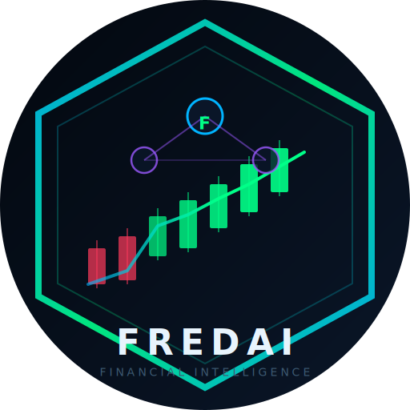

<div align="center">



# FredAI — Global Financial Intelligence

**AI-powered financial signals, portfolio intelligence, and live market awareness — in one self-hosted dashboard.**

[](https://github.com/essentialbit/fredai/actions/workflows/ci.yml)
[](https://github.com/essentialbit/fredai/releases/latest)
[](https://ghcr.io/essentialbit/fredai)
[](https://www.python.org/)
[](LICENSE)
[](https://github.com/essentialbit/fredai/discussions)

[Quick Start](#-one-command-start) · [Features](#-what-fred-does) · [Install Guide](#-installation) · [User Guide](#-using-fred) · [Security](#-security) · [Contribute](#-contributing)

</div>

---

<!-- CHANGELOG_START -->
## What's New

See the full list at [github.com/essentialbit/fredai/releases](https://github.com/essentialbit/fredai/releases).

### FredAI v1.3.77
- docs: sync README changelog to v1.3.76 (#428)
- feat: sentiment reversal early warning -- bearish/bullish flip detection (closes #132)

### FredAI v1.3.76
- fix: gitignore .claude/worktrees to prevent accidental gitlink commits (#373)

### FredAI v1.3.75
- fix: branch off before committing in git_push() to stop stray commits landing on main (closes #265) (#266)
- docs: sync README changelog to v1.3.74 (#412)

### FredAI v1.3.74
- fix: verify actual FredAI identity, not just port occupancy, in launcher scripts (#411)
- docs: sync README changelog to v1.3.73 (#379)

### FredAI v1.3.73
- feat: promote Landing Zone to prod, rename 'Home' (#371)

<!-- CHANGELOG_END -->

---

## What is FredAI?

Fred is a **self-hosted financial intelligence dashboard** that combines real-time market data, AI-powered signal analysis, global news aggregation, and a conversational advisor into one private, locally-run application.

Unlike Bloomberg Terminal (expensive), Robinhood (limited data), or generic AI chatbots (no live market context), Fred runs on *your* hardware — from a Raspberry Pi to a Mac — and connects directly to your financial data without sending it to third parties.

**Fred thinks like an analyst, not a search engine.** Every 4 hours he scans global signals, weighs sentiment across 26 news sources, monitors your watchlist and portfolio, and produces a briefing — proactively, without you having to ask.

Fred's development is guided by a single overarching mission: become the world's first **Financial Super Intelligence (FSI)** — an AI that doesn't just aggregate market data but builds a deep, causal, self-improving understanding of global financial systems. Every 6-hour improvement cycle pushes Fred one level further along the FSI roadmap: from Signal Intelligence (awareness) → Pattern Intelligence (structure) → Predictive Intelligence (foresight) → Reasoning Intelligence (causation) → World Model (context) → Super Intelligence (edge). See [MISSION.md](MISSION.md) for the full roadmap.

---

## What Fred Does

| Capability | Detail |
|-----------|--------|
| **Live Market Intelligence** | Real-time prices, OHLCV charts, and technical alerts for any equity, ETF, or crypto |
| **AI Signal Analysis** | Reads X/Twitter, 26 global RSS feeds, and sentiment-scores every story against VADER + Claude |
| **Fred Chat** | Conversational AI advisor with memory of your portfolio and interests; ask anything |
| **Global Signal Globe** | Interactive 3-D WebGL globe showing where live financial news is originating — spin it, filter by category |
| **News Intelligence Feed** | 3-tab news page: global feed with filters, animated signal globe, and embedded video (Bloomberg, Yahoo Finance, CNBC) |
| **Portfolio Tracker** | Multi-asset portfolio with live P&L, cost basis, and position sizing |
| **Watchlist & Alerts** | Custom watchlist with technical alerts (RSI, MACD, volume spikes, price breaks) |
| **AI Universe** | Full sector map of the AI revolution — every public AI company, live |
| **Earnings Calendar** | Next 30-day earnings events for your watchlist |
| **Self-Updating** | Polls GitHub every 6 hours; applies updates automatically (configurable) |
| **Multi-Platform** | macOS, Windows, Linux, Raspberry Pi, Docker, cloud VM |
| **Auto-Installs Shortcuts** | Creates native app icons on first launch — Desktop, Dock, Start Menu, App Menu |
| **PWA Support** | Install as a native-feeling app on mobile from Chrome or Safari |

---

## One-Command Start

### Docker (fastest — works on any OS with Docker installed)

```bash
# 1. Copy the env template
curl -sO https://raw.githubusercontent.com/essentialbit/fredai/main/.env.example

# 2. Add your API keys (see Key Setup below)
nano .env

# 3. Launch
docker compose up -d
```

Open **http://localhost:8080** — Fred is running.

---

## Installation

Choose the path that matches your device:

- [macOS](#macos)
- [Windows 10 / 11](#windows-10--11)
- [Linux (Ubuntu / Debian)](#linux-ubuntu--debian)
- [Raspberry Pi](#raspberry-pi)
- [Docker (any platform)](#docker-any-platform)
- [Cloud VM / VPS](#cloud-vm--vps)
- [iPhone / iPad (PWA)](#iphone--ipad)
- [Android (PWA — connect to existing server)](#android)
- [Android (Self-Hosted via Termux)](#android-self-hosted-via-termux)

---

### macOS

**Requirements:** macOS 12+, Python 3.12+

```bash
# 1. Install Python 3.13 (skip if already installed)
brew install python@3.13

# 2. Clone FredAI
git clone https://github.com/essentialbit/fredai.git
cd fredai

# 3. Create virtual environment and install dependencies
python3 -m venv venv
source venv/bin/activate
pip install -r requirements.txt

# 4. Configure API keys
cp .env.example .env
open .env          # edit in TextEdit, or: nano .env

# 5. Start Fred
python3 main.py
```

On first launch, Fred automatically:
- Creates `/Applications/FredAI.app` with icon
- Adds a **Desktop shortcut**
- **Pins to your Dock**
- Registers with Spotlight (searchable as "FredAI")

Open **http://localhost:8080**, create your account, and you're in.

**To keep Fred running in the background after closing Terminal:**

```bash
# Install as a launchd service (auto-starts on login)
cp deploy/com.essentialbit.fredai.plist ~/Library/LaunchAgents/
launchctl load ~/Library/LaunchAgents/com.essentialbit.fredai.plist
```

---

### Windows 10 / 11

**Requirements:** Windows 10+, Python 3.12+, Git

```powershell
# 1. Install Python from https://python.org — check "Add Python to PATH"
# 2. Open PowerShell as Administrator

# 3. Clone and set up
git clone https://github.com/essentialbit/fredai.git
cd fredai
python -m venv venv
.\venv\Scripts\Activate.ps1
pip install -r requirements.txt

# 4. Configure API keys
copy .env.example .env
notepad .env

# 5. Start Fred
python main.py
```

On first launch, Fred creates:
- A **Desktop shortcut** (`FredAI.url`)
- A **Start Menu entry** under Programs

Open **http://localhost:8080** in your browser.

**To auto-start with Windows:**

```powershell
# Create a scheduled task to start Fred at login
$action = New-ScheduledTaskAction -Execute "python" -Argument "main.py" -WorkingDirectory (Get-Location)
$trigger = New-ScheduledTaskTrigger -AtLogOn
Register-ScheduledTask -TaskName "FredAI" -Action $action -Trigger $trigger -RunLevel Highest
```

---

### Linux (Ubuntu / Debian)

**Requirements:** Ubuntu 20.04+ or Debian 11+, Python 3.13+

```bash
# 1. Install dependencies
sudo apt update
sudo apt install -y python3.13 python3.13-venv python3-pip git

# 2. Clone and set up
git clone https://github.com/essentialbit/fredai.git
cd fredai
python3 -m venv venv
source venv/bin/activate
pip install -r requirements.txt

# 3. Configure API keys
cp .env.example .env
nano .env

# 4. Start Fred
python3 main.py
```

On first launch, Fred creates:
- `~/.local/share/applications/fredai.desktop` (App Menu)
- `~/Desktop/fredai.desktop` shortcut
- Icons in `~/.local/share/icons/hicolor/`

**Run as a systemd service (auto-start on boot):**

```bash
# Copy the service file
sudo cp deploy/fredai.service /etc/systemd/system/
# Edit the path inside to match your install directory
sudo nano /etc/systemd/system/fredai.service
# Enable and start
sudo systemctl daemon-reload
sudo systemctl enable fredai
sudo systemctl start fredai
# Check status
sudo systemctl status fredai
```

---

### Raspberry Pi

Fred runs on Raspberry Pi 3B+ or newer (Pi 4/5 recommended for full features). Pi Zero 2 W runs in Lite Mode (reduced feature set).

**Requirements:** Raspberry Pi OS (64-bit recommended), Python 3.11+

```bash
# 1. Update and install deps
sudo apt update && sudo apt upgrade -y
sudo apt install -y python3 python3-venv python3-pip git

# 2. Clone FredAI
git clone https://github.com/essentialbit/fredai.git
cd fredai

# 3. Use the lightweight requirements for Pi (skips heavy ML libs)
python3 -m venv venv
source venv/bin/activate
pip install -r requirements-lite.txt

# 4. Configure
cp .env.example .env
nano .env

# 5. Start
python3 main.py
```

Fred auto-detects Raspberry Pi via `/proc/device-tree/model` and enters Lite Mode on devices with <1 GB RAM:
- No heavy batch market fetches (on-demand only)
- Compressed SQLite journal
- Reduced news polling interval

**Access from other devices on your network:**
Fred binds to `0.0.0.0:8080` — visit `http://<pi-ip>:8080` from any device on your LAN.

**Find your Pi's IP:**
```bash
hostname -I
```

**Auto-start on Pi boot:**
```bash
sudo cp deploy/fredai.service /etc/systemd/system/
sudo nano /etc/systemd/system/fredai.service   # update WorkingDirectory
sudo systemctl enable fredai && sudo systemctl start fredai
```

---

### Docker (Any Platform)

The fastest and most portable install. Works on macOS, Windows, Linux, any cloud VM, and Raspberry Pi (ARM64).

```bash
# Pull and run in one command
docker run -d \
  --name fredai \
  --restart unless-stopped \
  -p 8080:8080 \
  -v fredai_data:/app/data \
  -e ANTHROPIC_API_KEY=your_key_here \
  ghcr.io/essentialbit/fredai:latest
```

**Or use Docker Compose (recommended — easier config):**

```bash
git clone https://github.com/essentialbit/fredai.git
cd fredai
cp .env.example .env
nano .env                   # add your API keys
docker compose up -d        # builds image and starts Fred
docker compose logs -f      # tail logs
```

**Updating to the latest version:**
```bash
docker compose pull
docker compose up -d
```

---

### Cloud VM / VPS

Deploy Fred on any cloud provider (AWS, GCP, Azure, DigitalOcean, Hetzner, etc.) with a public URL.

**Minimum spec:** 1 vCPU, 1 GB RAM, 10 GB storage (t3.micro / e2-micro class)

```bash
# On your VM (Ubuntu 22.04):
sudo apt update && sudo apt install -y docker.io docker-compose-plugin git
sudo usermod -aG docker $USER && newgrp docker

git clone https://github.com/essentialbit/fredai.git
cd fredai
cp .env.example .env && nano .env

# Start with Traefik reverse proxy (includes HTTPS)
docker compose -f docker-compose.yml up -d
```

**To add HTTPS (strongly recommended for cloud deploys):**

```bash
# Add your domain A record → VM IP, then:
sudo apt install -y certbot
certbot certonly --standalone -d yourdomain.com
# Update deploy/nginx.conf with your domain and cert paths
```

---

### iPhone / iPad

Fred runs as a **Progressive Web App (PWA)** — no App Store, no subscription. It installs like a native app straight from your browser.

#### Before you start — Fred must be running somewhere on your network

Your iPhone connects to Fred running on another device (your Mac, PC, or Raspberry Pi). Both must be on the **same Wi-Fi network**.

**Step 1 — Find Fred's address on the host computer**

On the computer running Fred, find its local IP address:

| OS | How |
|----|-----|
| Mac | System Settings → Network → Wi-Fi → Details → IP Address |
| Windows | Start → cmd → type `ipconfig` → look for "IPv4 Address" under Wi-Fi |
| Linux / Pi | Open Terminal → type `hostname -I` → first address shown |

The address looks like `192.168.1.x` or `10.0.0.x`. Write it down.

**Step 2 — Confirm Fred is running**

On the host computer, make sure Fred is started (`python3 main.py` or Docker is running). You should be able to open `http://YOUR_IP:8080` in a browser on that computer and see the Fred login page.

**Step 3 — Install on iPhone/iPad**

> **Important:** You must use **Safari** — Chrome on iOS cannot install PWAs.

1. Open **Safari** on your iPhone or iPad
2. In the address bar, type: `http://YOUR_IP:8080` (replace YOUR_IP with the address from Step 1)
3. Log in to Fred
4. Tap the **Share button** — the box with an arrow pointing up, at the bottom of the screen
5. Scroll down in the share sheet and tap **"Add to Home Screen"**
6. Tap **"Add"** in the top-right corner

Fred now appears as a full-screen app on your home screen with its own icon — no browser bar, no address bar, indistinguishable from a native app.

#### Can't connect? Try these

| Problem | Fix |
|---------|-----|
| Page won't load | Check both devices are on the same Wi-Fi. Try the IP in a browser on the host computer first |
| "Add to Home Screen" not visible | Scroll down in the share sheet — it may be below the visible area |
| Using Chrome on iPhone | Switch to Safari — Apple requires PWA installation through Safari on iOS |
| Fred stopped working after closing Terminal | See "Keep Fred running" in the macOS section above |

#### Accessing Fred away from home (optional)

If you want to reach Fred from anywhere — not just your home Wi-Fi — the easiest method is **Tailscale** (free):

1. Install Tailscale on the host computer and your phone: [tailscale.com](https://tailscale.com)
2. Sign in to the same Tailscale account on both
3. Use the Tailscale IP address (shown in the Tailscale app) instead of your local IP

No port forwarding, no static IP, no router configuration needed.

---

### Android

Fred installs as a PWA directly from Chrome.

#### Before you start — same Wi-Fi requirement

Your Android phone must be on the same Wi-Fi network as the computer running Fred. Follow Step 1 and Step 2 from the iPhone section above to find Fred's address and confirm it's running.

**Installing on Android:**

1. Open **Chrome** on your Android device
2. In the address bar, type: `http://YOUR_IP:8080`
3. Log in to Fred
4. You will see one of two prompts — use whichever appears:
   - **Bottom banner:** A bar appears at the bottom of the screen saying "Add Fred to Home screen" → tap **Add**
   - **Menu option:** If no banner appears, tap the **three-dot menu** (⋮) in the top-right → tap **"Add to Home screen"** or **"Install app"** → tap **Add**
5. Fred icon appears on your home screen

> **Note:** Firefox on Android does not support PWA installation. Use Chrome.

#### Can't connect? Try these

| Problem | Fix |
|---------|-----|
| Page won't load | Confirm both devices are on the same Wi-Fi and Fred is running on the host |
| No install prompt and no menu option | Load the page, wait 30 seconds, then check the menu again |
| Using Firefox | Switch to Chrome |
| Fred stopped after you closed the terminal | Restart Fred on the host computer |

#### Accessing Fred away from home (optional)

Same as iOS — install **Tailscale** on both devices for free remote access without port forwarding.

---

### Android (Self-Hosted via Termux)

Android phones are ARM Linux computers. A modern Android phone (4GB+ RAM) can run Fred as a full server — no other device needed. This is ideal for turning an old Android phone into a dedicated always-on Fred server.

> **iPhone/iPad cannot self-host.** iOS does not allow background network servers. iPhone/iPad users must connect to Fred running on another device (Mac, PC, Pi, Android, or cloud).

#### What you need

- Android phone or tablet, Android 7.0+ (any brand)
- At least 4GB RAM recommended (2GB works in a pinch)
- At least 2GB free storage
- Charger plugged in (Fred runs continuously)
- [Termux](https://f-droid.org/packages/com.termux/) installed — **download from F-Droid, not the Play Store** (the Play Store version is outdated and broken)

#### Step 1 — Install Termux

1. On your Android device, open this link in Chrome: **f-droid.org/packages/com.termux**
2. Tap **Download APK**
3. When prompted, allow "Install from unknown sources" for your browser
4. Install the APK
5. Open Termux

#### Step 2 — Install Python and dependencies

In Termux, run these commands one at a time:

```bash
# Update package list
pkg update -y && pkg upgrade -y

# Install Python, Git, and build tools
pkg install python git clang libffi openssl -y

# Install numpy and pandas as pre-compiled packages (much faster than pip)
pkg install python-numpy python-pandas -y

# Clone Fred
git clone https://github.com/essentialbit/fredai.git
cd fredai

# Install remaining Python dependencies
pip install flask flask-socketio feedparser beautifulsoup4 anthropic \
    apscheduler vaderSentiment python-dotenv requests werkzeug psutil
```

> **Why `pkg install python-numpy python-pandas` instead of pip?** Termux ships pre-compiled ARM64 binaries for numpy and pandas. Installing via pip would attempt to compile from source, which takes 30+ minutes and often fails.

#### Step 3 — Configure Fred

```bash
# Still inside the fredai directory
cp .env.example .env

# Edit with nano (arrow keys to navigate, Ctrl+O to save, Ctrl+X to exit)
nano .env
```

Add at least one AI provider key (`ANTHROPIC_API_KEY`, `GEMINI_API_KEY`, `XAI_API_KEY`, or `GROQ_API_KEY` — see [API Key Setup](#api-key-setup) below for the free options), or skip all of them and install Ollama for a fully free, offline setup. Everything else is optional.

#### Step 4 — Start Fred

```bash
python main.py
```

Fred starts on port 8080. Open Chrome on the same phone and go to `http://localhost:8080` to access it. Create your account and you're in.

To install it as a PWA on the same phone, follow the Android PWA steps above using `http://localhost:8080` as the URL.

#### Step 5 — Keep Fred running when the screen locks

Android kills background processes to save battery. Two things to fix this:

**Disable battery optimisation for Termux:**
1. Open Android Settings → Battery → Battery Optimisation (name varies by manufacturer)
2. Find Termux → set to **"Don't optimise"** or **"Unrestricted"**

**Acquire a wake lock inside Termux:**
```bash
# Run this before starting Fred (keeps CPU awake)
termux-wake-lock
python main.py
```

Or keep Termux in the foreground by enabling the **persistent notification**: swipe down from the top, find the Termux notification, and tap **"Acquire wakelock"**.

#### Step 6 — Access from other devices on your network

Other phones, tablets, and computers on the same Wi-Fi can connect to Fred running on your Android. They need your Android's IP address:

```bash
# In Termux, run:
ifconfig wlan0 | grep "inet "
# or:
ip addr show wlan0 | grep "inet "
```

The address shown (e.g. `192.168.1.42`) is what other devices type into their browser: `http://192.168.1.42:8080`

#### Troubleshooting

| Problem | Fix |
|---------|-----|
| `pkg install python-numpy` fails | Run `pkg update -y` first, then retry |
| Fred crashes with a memory error | Close other apps; 2GB RAM is the minimum; consider using a phone with 4GB+ |
| Fred stops when phone screen locks | Follow Step 5 above — battery optimisation must be disabled |
| Can't connect from another device | Get Termux's IP (`ifconfig wlan0`) and use that address, not `localhost` |
| `permission denied` on `.env` | Run `chmod 600 .env` |
| Port 8080 already in use | Another app is using the port — change `PORT=8081` in `.env` |

---

## API Key Setup

Fred uses several external APIs. Here's exactly what you need and where to get each one:

### AI provider — pick at least one (Fred tries them in this order, falls back automatically)

| Key | Where to get | Cost |
|-----|-------------|------|
| `ANTHROPIC_API_KEY` | [console.anthropic.com](https://console.anthropic.com) | Pay-per-use (~$0.25/1M tokens on Haiku) — best quality |
| `GEMINI_API_KEY` | [aistudio.google.com](https://aistudio.google.com) | Free tier available (rate-limited) |
| `XAI_API_KEY` | [console.x.ai](https://console.x.ai) | Pay-per-use — frontier-quality (Grok) |
| `GROQ_API_KEY` | [console.groq.com](https://console.groq.com) | **Free**, no cost, cloud-hosted |
| *(none — install Ollama instead)* | [ollama.com](https://ollama.com), then `ollama pull llama3.2` | **Free**, fully on-device, no API key needed |

New to Fred? The simplest zero-cost path: install Ollama, run `ollama pull llama3.2`, set `AI_PROVIDER=ollama` in `.env`, and skip every key on this list — Fred runs entirely offline. Add any of the cloud keys above later for better quality; Fred will pick them up automatically without any other config changes.

### Highly Recommended

| Key | Where to get | Free tier |
|-----|-------------|-----------|
| `X_BEARER_TOKEN` | [developer.twitter.com](https://developer.twitter.com) — create an app | Free tier: 1M reads/month |
| `X_CONSUMER_KEY` | Same app credentials | Same |
| `X_CONSUMER_SECRET` | Same app credentials | Same |
| `X_ACCESS_TOKEN` | Same — "Keys and Tokens" tab | Same |
| `X_ACCESS_TOKEN_SECRET` | Same — "Keys and Tokens" tab | Same |

### Optional

| Key | What it unlocks | Where to get |
|-----|----------------|-------------|
| `NASDAQ_API_KEY` | Nasdaq Data Link (fundamentals, economic data) | [data.nasdaq.com](https://data.nasdaq.com) — free |

### Security keys (generate before exposing to a network)

| Key | Purpose | How to generate |
|-----|---------|----------------|
| `SECRET_KEY` | Flask session signing — prevents cookie tampering | `python3 -c "import secrets; print(secrets.token_hex(32))"` |
| `FREDAI_ADMIN_PASSWORD` | Pins the initial admin password on first run | Any strong password — remove from `.env` after first login |
| `FREDAI_DEPLOY_SECRET` | Authenticates CI webhook pushes (`POST /api/update/apply`) | `python3 -c "import secrets; print(secrets.token_hex(32))"` — also add to GitHub Actions Secrets |

> **Without `SECRET_KEY`:** Fred auto-generates a random key at startup. Sessions work but don't survive a restart — users have to log in again. Fine for local use; set a permanent key for server installs.

> **Without `FREDAI_DEPLOY_SECRET`:** CI webhook-push updates are disabled. Fred still polls GitHub every 6 hours and shows an update badge.

**Without X/Twitter keys:** Fred still works fully — news, market data, portfolio, Fred chat, and the globe all function. You lose X signal analysis and trending data.

**Without Anthropic key:** Fred's conversational advisor, 4-hour briefings, and AI-generated summaries are disabled. All other features (live prices, charts, news, portfolio) still work.

**.env file template (copy from `.env.example`):**
```env
# Generate strong keys first:
# python3 -c "import secrets; print(secrets.token_hex(32))"

SECRET_KEY=<64-char-hex>
FREDAI_ADMIN_PASSWORD=<strong-password>   # remove after first login
FREDAI_DEPLOY_SECRET=<64-char-hex>        # also add to GitHub Actions Secrets

ANTHROPIC_API_KEY=sk-ant-...
X_BEARER_TOKEN=AAAA...
X_CONSUMER_KEY=...
X_CONSUMER_SECRET=...
X_ACCESS_TOKEN=...
X_ACCESS_TOKEN_SECRET=...
NASDAQ_API_KEY=...           # optional
PORT=8080
AUTO_UPDATE=notify
```

---

## Using Fred

### First-Time Setup (5 minutes)

1. **Create your account** — sign up on the login page. Fred is multi-user; your data is private to your account.
2. **Build your watchlist** — go to Watchlist tab → type any ticker (AAPL, BTC-USD, NVDA, ASX:BHP) and add it. Fred will track it live.
3. **Enter your portfolio** — Portfolio tab → add positions with cost basis. Fred calculates live P&L.
4. **Let Fred scan** — Fred runs his first analysis cycle on startup. Within a few minutes, the Overview will populate with signals, sentiment, and a briefing.

---

### The Dashboard — Tab by Tab

#### Overview
Your command centre. At a glance:
- **KPI bar** — total signals, bull/bear sentiment ratio, top mover, volatility index
- **Market strip** — live prices for your watchlist scrolling across the top
- **Fred Briefing** — AI-generated 4-hour market narrative (auto-refreshes)
- **Signal feed** — every news signal that moved the needle, scored and ranked
- **Price chart** — interactive TradingView-style OHLCV chart for any symbol
- **Sentiment chart** — rolling sentiment score over time (bullish/bearish tide)

**Tip:** Click any signal to see the full article. Click any ticker in the signal to load its chart instantly.

#### Watchlist
- Add any ticker: US stocks, ETFs, ASX stocks (suffix `.AX`), crypto (suffix `-USD`)
- Each row shows live price, change %, and a sentiment indicator from recent news
- Click a row to load the full chart and recent signals for that symbol

#### Portfolio
- Add positions with entry price and quantity
- Fred shows live market value, unrealised P&L, and portfolio weight
- The right panel shows a portfolio allocation chart
- Use this to track what you own and how your investments are performing

#### Trending
- What's surging on X/social right now — ranked by signal velocity (rate of mentions)
- The chart on the right shows the trend arc over the last 4 hours
- Use this to catch moves before they hit mainstream financial media

#### AI Universe
- Every publicly listed AI company, grouped by sector: Infrastructure, Models, Chips, Applications, Data, Robotics
- Live prices and sentiment for the full AI investment landscape
- Use this if you want exposure to the AI theme without researching individual stocks

#### Globe (◎)
- Interactive 3-D globe showing where financial news signals are coming from in real-time
- Coloured dots = signal type: Blue (Markets), Green (AI/Tech), Red (Geopolitical), Gold (Central Banks)
- Bigger dot = more signals from that city
- Click a dot to jump straight to that category's news feed
- Drag to spin; scroll to zoom; filter buttons at top refine by category

#### News ↗ (opens full page)
Three tabs:

**News Feed** — Sidebar filters: category, time window (4h → 7d), ticker filter, sentiment filter. Every article scored with a bull/bear indicator. Real-time search bar.

**Signal Globe** — Same 3-D globe as the dashboard but full-screen, with spinning animation and click-to-filter.

**Video Intel** — Latest videos from Bloomberg, Yahoo Finance, and CNBC embedded directly. Watch financial news without leaving Fred. Click any video in the sidebar to play it in the main panel.

---

### Talking to Fred

Fred chat is in the bottom-right of every page. Fred knows:
- Your current portfolio and unrealised P&L
- Your watchlist and interests
- The latest signals and market briefing
- Real-time prices

**Questions that work well:**
- *"What's happening with NVDA today?"*
- *"Is now a good time to add to my AAPL position?"*
- *"Explain the Fed decision and what it means for my tech holdings"*
- *"What's the biggest macro risk to my portfolio right now?"*
- *"Give me a bear case and a bull case for Bitcoin"*
- *"Which of my positions have the most negative sentiment right now?"*
- *"Summarise the last 24 hours of market news"*

Fred remembers your preferences and portfolio within a session. The more you tell him about your investing style, the better his answers become.

---

### Technical Alerts

Fred monitors your watchlist for:
- **RSI extremes** — overbought (>70) or oversold (<30)
- **MACD crossovers** — momentum direction changes
- **Volume spikes** — unusual trading activity
- **Price breaks** — crossing above/below key levels

Alerts appear as banners in the dashboard and are logged to the signal feed. No configuration needed — Fred watches automatically once symbols are on your watchlist.

---

### Auto-Updates

Fred checks GitHub for updates every 6 hours. You control what happens:

| `AUTO_UPDATE` setting | Behaviour |
|----------------------|-----------|
| `notify` (default) | Shows a badge on the Install button; you click to apply |
| `auto` | Applies updates silently in the background |
| `off` | Never checks for updates |

To apply an update manually:
- Click the **⬇ Install** button in the top-right of the dashboard
- Click **"Apply Update"** in the modal

---

## Architecture

```
fredai/
├── main.py              # Flask app, all routes, WebSocket, APScheduler
├── agent.py             # Fred persona, Claude integration
├── soul.md              # Fred's identity and values (do not modify)
├── installer.py         # Auto-installs native shortcuts on first launch
├── updater.py           # GitHub polling, /api/update/* routes
├── news_client.py       # 26-source RSS aggregator + VADER sentiment
├── market_data.py       # yfinance live prices + OHLCV history
├── twitter_client.py    # X/Twitter API v2 signal scraper
├── trend_detector.py    # Sentiment shift detection + alerting
├── technical_alerts.py  # RSI, MACD, volume, price-break monitors
├── memory_store.py      # SQLite: users, watchlist, portfolio, signals
├── improve.py           # Self-improvement R&D cycle (CI-driven)
├── templates/
│   ├── dashboard.html   # Main single-page app
│   ├── news.html        # News intelligence (feed + globe + video)
│   └── graph.html       # Intelligence graph
├── static/
│   ├── icons/           # PWA icons (16→1024px)
│   └── manifest.json    # PWA manifest
├── assets/
│   └── icons/           # Platform-specific icons (.icns, .ico, .png)
├── deploy/
│   ├── fredai.service   # systemd unit file
│   └── nginx.conf       # Nginx reverse proxy config
├── Dockerfile
├── docker-compose.yml
└── requirements.txt
```

**Data flow:**
1. APScheduler triggers every 4h (market scan) + 30min (news) + 1min (prices)
2. `twitter_client` + `news_client` pull raw signals
3. VADER scores sentiment; Claude generates narrative summaries
4. `trend_detector` identifies velocity shifts and fires alerts via WebSocket
5. Dashboard receives live updates via Socket.IO — no page refresh needed

---

## Configuration Reference

All configuration is via environment variables in `.env`:

```env
# ── Core ─────────────────────────────────────────────────────────────────────
PORT=8080
AUTO_UPDATE=notify            # notify | auto | off

# ── Security (important — set before exposing to network) ────────────────────
# Generate: python3 -c "import secrets; print(secrets.token_hex(32))"
SECRET_KEY=                   # Flask session signing key — auto-generated if unset (sessions don't survive restarts)

# Initial admin account password (only used on first run, when DB is empty)
# If unset, a random password is printed to the console once.
# Remove from .env after first login.
FREDAI_ADMIN_PASSWORD=

# Deploy webhook secret — CI sends this as X-FredAI-Deploy header (HMAC-verified)
# Set the same value in GitHub Actions → Settings → Secrets → FREDAI_DEPLOY_SECRET
# If unset, CI-push updates are disabled (6h poll still works)
FREDAI_DEPLOY_SECRET=

# ── AI (pick at least one, or install Ollama for a fully free/offline setup) ─
ANTHROPIC_API_KEY=...         # Best quality, pay-per-use
ANTHROPIC_MODEL=claude-sonnet-4-6
ANTHROPIC_FAST_MODEL=claude-haiku-4-5-20251001
GEMINI_API_KEY=               # Free tier available
XAI_API_KEY=                  # Grok, pay-per-use, frontier-quality
GROQ_API_KEY=                 # Free, cloud-hosted, no cost

# ── Market data ──────────────────────────────────────────────────────────────
NASDAQ_API_KEY=               # Optional — Nasdaq Data Link

# ── Social signals ───────────────────────────────────────────────────────────
X_BEARER_TOKEN=
X_CONSUMER_KEY=
X_CONSUMER_SECRET=
X_ACCESS_TOKEN=
X_ACCESS_TOKEN_SECRET=

# ── Scheduler ────────────────────────────────────────────────────────────────
MARKET_REFRESH_SECONDS=60     # Live price refresh interval
SCAN_INTERVAL_HOURS=4         # Full AI scan cycle
```

---

## Roadmap — Financial Super Intelligence

Fred is on a deliberate path to become the world's most capable financial AI. Each level builds on the last. No level is skipped.

| Level | Name | Status | What it adds |
|-------|------|--------|-------------|
| **L1** | Signal Intelligence | ✅ Complete | Real-time sentiment, live prices, 4h briefings, portfolio tracking |
| **L2** | Pattern Intelligence | 🔄 Active | FinBERT NLP, cross-asset correlation, options flow, insider filings, Fear & Greed |
| **L3** | Predictive Intelligence | 🔲 Queued | Backtested signal accuracy, macro regime detection, earnings prediction, anomaly detection |
| **L4** | Reasoning Intelligence | 🔲 Queued | Bull vs Bear multi-agent debate, causal attribution, 10-K analysis, institutional 13F positioning |
| **L5** | World Model | 🔲 Future | Cross-market contagion, alternative data (satellite, job listings), agent swarms, fine-tuned LLM |
| **L6** | Super Intelligence | 🔲 Future | Self-directing research, novel edge discovery, autonomous recommendations, edge detection before consensus |

Every 6-hour improvement cycle is evaluated against this roadmap. Contributions that advance a higher level are prioritised over cosmetic improvements. See [MISSION.md](MISSION.md) for the complete specification.

---

## Contributing

Fred is open to community contributions. Here's how to get involved:

### Ways to contribute

| Type | How |
|------|-----|
| **Bug report** | [Open an issue](https://github.com/essentialbit/fredai/issues/new?template=bug_report.md) |
| **Feature idea** | [Start a Discussion](https://github.com/essentialbit/fredai/discussions/new?category=ideas) |
| **Code PR** | Fork → branch → PR (see below) |
| **New data source** | Add feed to `news_client.py` + coordinates to `SOURCE_COORDINATES` |
| **New alert type** | Add to `technical_alerts.py` |
| **Translations / docs** | Edit `.md` files — always welcome |
| **Share your setup** | [Show & Tell discussions](https://github.com/essentialbit/fredai/discussions/new?category=show-and-tell) |

### Development setup

```bash
git clone https://github.com/essentialbit/fredai.git
cd fredai
python3 -m venv venv && source venv/bin/activate
pip install -r requirements.txt
cp .env.example .env        # add your keys
python3 main.py             # start dev server
```

### Pull request process

1. Fork the repo
2. Create a branch: `git checkout -b feature/your-idea`
3. Make changes — keep to the existing code style (no trailing summaries in comments, WHY-only comments)
4. Test: `python3 -c "from main import app; print('OK')"`
5. Push and open a PR — describe *what* changed and *why*

### What we're looking for

- New free/low-cost financial data sources
- Better signal filtering and deduplication logic
- Frontend improvements to charts and the globe
- Platform-specific installer improvements (Flatpak, Snap, .dmg, .exe)
- Mobile UI polish
- Test coverage (`tests/` — any tests are better than none)

See [CONTRIBUTING.md](CONTRIBUTING.md) for the full guide.

---

## Community & Feedback

| Channel | Purpose |
|---------|---------|
| [GitHub Issues](https://github.com/essentialbit/fredai/issues) | Bug reports, confirmed problems |
| [GitHub Discussions](https://github.com/essentialbit/fredai/discussions) | Ideas, questions, show & tell, general chat |
| [Feature Requests](https://github.com/essentialbit/fredai/discussions/new?category=ideas) | Suggest what Fred should do next |
| [Show & Tell](https://github.com/essentialbit/fredai/discussions/new?category=show-and-tell) | Share your setup, screenshots, or custom deployments |

### How Fred responds to community interactions

Fred's CI pipeline runs a community engagement cycle every 6 hours using Claude. It reads Issues, Discussions, and open PRs and responds automatically:

| Interaction type | What Fred does |
|-----------------|---------------|
| Bug report | Acknowledges the issue, asks for missing details (OS, Python version, logs), applies `bug` label |
| Feature request | Thanks the contributor, explains how it fits the roadmap, applies `enhancement` label |
| New data source suggestion | Asks for RSS URL + geographic coordinates for the Signal Globe, applies `data-source` label |
| Question | Answers or points to the relevant section of the README / docs |
| Pull request | Thanks the contributor, notes what the PR covers, invites further discussion |
| Spam / hostile / off-topic | **No response** — silence is the correct answer; Fred does not engage with unproductive content |

Fred responds only once per item and won't duplicate comments. Responses are friendly and direct — not corporate, not sycophantic.

**To get the best response:** include your OS, Python version, install method, and any error output in bug reports. The more specific the issue, the more useful Fred's initial response will be.

---

## Security

Fred has been hardened against the OWASP top 10 attack classes. The following protections are active out of the box:

### What's protected

| Class | Protection |
|-------|-----------|
| **Brute-force login** | 10-attempt / 5-minute / per-IP rate limiter — returns HTTP 429 on lockout |
| **Session fixation** | Session ID rotated on every login (`session.clear()` before new session) |
| **Session persistence** | 30-day persistent cookies with `HttpOnly`, `SameSite=Lax`; `Secure` flag auto-set in HTTPS deployments |
| **Weak `SECRET_KEY`** | Auto-generates a cryptographically random ephemeral key if `SECRET_KEY` is not set in `.env` — warns on console. Sessions don't survive restarts until you set a permanent key. |
| **Default admin password** | No hardcoded password. On first run (empty DB), a random password is generated and printed to the console **once**. Set `FREDAI_ADMIN_PASSWORD` in `.env` to pin it. |
| **Unauthenticated deploy webhook** | `POST /api/update/apply` requires `HMAC-SHA256` verification of `X-FredAI-Deploy` header against `FREDAI_DEPLOY_SECRET`. If the secret is not configured, CI-push updates are disabled entirely. |
| **XSS** | All server-derived strings escaped via `esc()` before DOM insertion. No raw `innerHTML` with untrusted data. |
| **SocketIO CORS** | `cors_allowed_origins=[]` — same-origin only, no wildcard. |
| **Security headers** | Every response includes: `X-Content-Type-Options: nosniff`, `X-Frame-Options: SAMEORIGIN`, `Referrer-Policy: strict-origin-when-cross-origin`, `Permissions-Policy: camera=(), microphone=(), geolocation=()`, and a Content Security Policy covering script/style/font/image/frame/connect sources. |
| **Admin-only routes** | `/api/rnd/run` and `/api/user/reset-password` check `is_admin` — non-admins get HTTP 403. |
| **Parameter bounds** | `hours`, `limit`, `page`, `days` are clamped to sane ranges server-side. `period` and `interval` for chart data are whitelisted to valid yfinance values. |
| **Error message disclosure** | Exception details stripped from all user-facing API error responses — internal errors logged to console only. |
| **SQL injection** | All DB queries use parameterised statements throughout `memory_store.py` — no string concatenation in SQL. |

### Production hardening checklist

Before exposing Fred to the internet:

```bash
# 1. Set a strong, permanent secret key
python3 -c "import secrets; print(secrets.token_hex(32))"
# → paste output as SECRET_KEY in .env

# 2. Set a deploy secret (if using CI webhook push)
python3 -c "import secrets; print(secrets.token_hex(32))"
# → paste as FREDAI_DEPLOY_SECRET in .env
# → add the same value as FREDAI_DEPLOY_SECRET in GitHub Actions Secrets

# 3. Set initial admin password (before first run)
# → set FREDAI_ADMIN_PASSWORD in .env
# → remove after first login and change via the UI

# 4. Put Fred behind a reverse proxy with TLS
#    deploy/nginx.conf has a ready-to-use template
#    Or use Caddy: caddy reverse-proxy --from yourdomain.com --to localhost:8080

# 5. Set AUTO_UPDATE=notify (default) or review what auto applies
```

### Responsible disclosure

Found a security issue? Please **do not open a public GitHub issue**. Instead:

1. Open a **private** issue with the label `conduct` (only maintainers see it)
2. Or email the maintainer directly via the GitHub profile contact

We aim to acknowledge within 48 hours and patch within 7 days for critical issues.

---

## Disclaimer

FredAI aggregates public financial data for **informational purposes only**. Nothing Fred says, shows, or generates constitutes financial advice. All investment decisions are yours. Past signals are not indicative of future performance.

---

## License

MIT — see [LICENSE](LICENSE). Use it, fork it, build on it.

---

<div align="center">
<sub>Built with Claude · Runs everywhere · Your data stays yours</sub>
</div>
